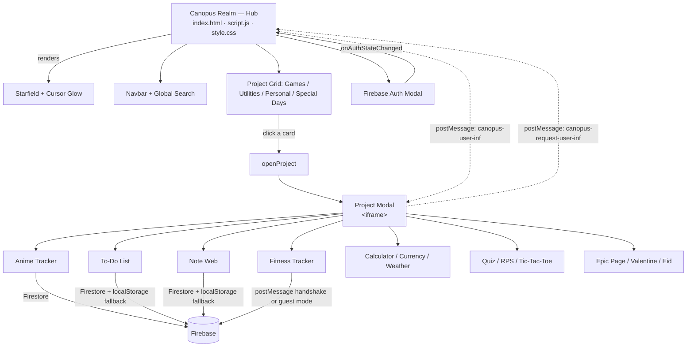
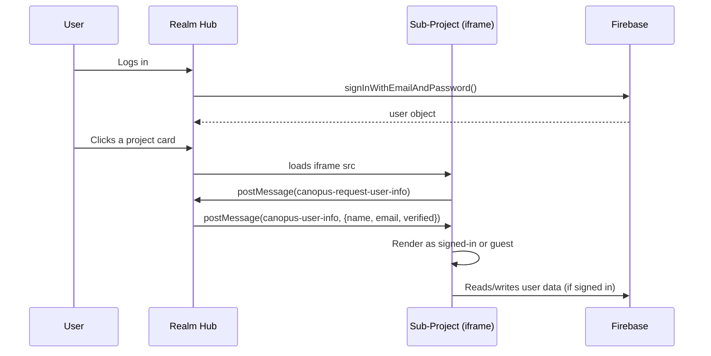

#  Canopus Realm

**One hub. Endless creations.**

Canopus Realm is a personal project hub — a single, cohesive web app that houses over a dozen small applications I've built and shipped over time: games, utilities, dashboards, and a couple of just-for-fun projects. Instead of scattering these across separate repos and forgotten links, they now live under one roof with a shared identity, a shared auth system, and a UI that doesn't look like it was stitched together at 2 a.m.

> This repo *used to be* 13–14 completely separate projects, each with its own repo, its own README, and its own inconsistent styling. It's now one realm. See [A note on the "100+ Commits" stat](#a-note-on-the-100-commits-stat) if you're wondering why the numbers don't quite add up.

14 projects built with 70vs source files and over 28,000 lines of HTML, CSS, and JavaScript.
---

## Table of Contents

- [Live Preview](#live-preview)
- [What's Inside](#whats-inside)
- [Architecture](#architecture)
- [Tech Stack](#tech-stack)
- [Project Structure](#project-structure)
- [Getting Started](#getting-started)
- [Firebase Setup](#firebase-setup-optional-but-recommended)
- [How the Hub Talks to Each App](#how-the-hub-talks-to-each-app)
- [A Note on the "100+ Commits" Stat](#a-note-on-the-100-commits-stat)
- [Design Philosophy](#design-philosophy)
- [Known Limitations](#known-limitations)
- [Roadmap](#roadmap)
- [Contributing](#contributing)
- [Credits](#credits)
- [License](#license)

---

## Live Preview

| | | |
|---|---|---|
|  **Games** |  **Utilities** |  **Personal** |
| Anime Tracker, Rock Paper Scissors, Tic Tac Toe, Quiz Master, Signing Stars | Calculator, Currency Converter, Weather | Fitness Tracker, Note Web, To-Do List, Epic Page |

|  **Special Days** |
|---|
| Valentine, Eid Sa3id |

Open `index.html` to land on the realm's home page — a starfield-backed landing experience with a featured-project carousel, category filters, and a global search that indexes every app by name and tag.

---

## What's Inside

Canopus Realm currently bundles **13 individual applications**, grouped into four categories:

### Games

| Project | Description | Highlights |
|---|---|---|
| **Anime Tracker** | Search, rate, and review anime using the Jikan (MyAnimeList) API | Firebase auth, personal watch-lists, star ratings, community reviews |
| **Rock Paper Scissors** *(Orbit Duel)* | A polished RPS game against an adaptive bot | Bot reads your last 6 moves and counters your habits, streak tracking, sound effects |
| **Tic Tac Toe** | Classic 3×3 with a twist | Normal 1v1 mode + a full bracket-style Competition/Tournament mode for 2–8 players |
| **Quiz Master** *(CanQuiz)* | Trivia across 9 categories | Math, History, Geography, Physics, Astronomy, Medicine, Sports, Celebrities, Culture — 20 questions each |
| **Signing Stars** | A personal karaoke website where you load your favorite songs and their lyrics and begin the fun | Firebase Auth, local storage, recording, favorites |

### Utilities
###  Utilities
| Project | Description | Highlights |
|---|---|---|
| **Calculator** | Basic + scientific calculator | Full scientific function set, calculation history, and a bundled mental-math quiz mode |
| **Currency Converter** | Real-time exchange rates for 30 currencies | Live conversion, favorites, history log, and a rate-trend chart (Chart.js) |
| **Weather** | Live weather lookup by city or geolocation | Powered by the OpenWeatherMap API, with sunrise/sunset, humidity, and feels-like data |

###  Personal
| Project | Description | Highlights |
|---|---|---|
| **Fitness Tracker** | Daily activity dashboard | Steps, calories, water, sleep, weight, BMI calculator, weekly trend charts, streaks & badges |
| **Note Web** *(Nebula)* | A color-coded notes app | Pinning, search, color filters, masonry layout |
| **To-Do List** *(Orbit)* | Task manager with priorities | Due dates, tags, priority levels, progress ring, undo-on-delete |
| **Epic Page** | Fan site for *Epic: The Musical* | Full 30-track audio player, saga-by-saga story breakdown, cast bios |

###  Special Days
| Project | Description | Highlights |
|---|---|---|
| **Valentine** | An interactive "will you be my Valentine" page | 10-step date planner with a generated PDF invitation |
| **Eid Sa3id** | A small Eid celebration page | Animated lanterns, starfield, confetti burst |

---

## Architecture

The realm is built as a **shell + iframe** system. The hub (`index.html` / `script.js` / `style.css`) owns navigation, search, authentication, and the "world" grid. Each sub-project is a fully self-contained app that gets loaded into a modal `<iframe>` when launched.



### Identity handshake (why this matters)

Sub-projects don't share the hub's JavaScript scope — an `<iframe>` is its own sandboxed window. So instead of assuming `window.auth` exists inside a loaded project, each app:

1. Tries direct `window.parent.auth` access (works only if same-origin and the hub exposes it — rare, and not relied upon).
2. Falls back to a `postMessage` handshake: the child app asks *"who's logged in?"*, the hub replies with `{ name, email, verified }`.
3. If neither works (opened standalone, outside the hub), the app quietly drops into **guest mode** and persists data to `localStorage` instead.

This is why apps like the Fitness Tracker and To-Do List work perfectly fine even if you open their `index.html` directly — they were designed to degrade gracefully.



---

## Tech Stack

Everything here is deliberately **framework-free** — vanilla HTML, CSS, and JavaScript throughout. No build step, no bundler, no `node_modules`. Clone it and open a file in a browser.

| Layer | Technology |
|---|---|
| Markup / Styling | HTML5, CSS3 (custom properties, Grid/Flexbox, glassmorphism, CSS-only animations) |
| Logic | Vanilla JavaScript (ES6+), no frameworks |
| Auth & Database | Firebase Authentication (compat SDK) + Cloud Firestore |
| Charts | Chart.js |
| Fonts | Google Fonts — Space Grotesk, Manrope, JetBrains Mono, Cinzel, Spectral (per-project theming) |
| Icons | Font Awesome 6 |
| External APIs | Jikan v4 (MyAnimeList), OpenWeatherMap, ExchangeRate-API |
| PDF Generation | jsPDF (Valentine planner) |
| Email | EmailJS (optional, Valentine planner) |

---

## Project Structure

```
canopus-realm/
├── index.html                 # Hub landing page
├── script.js                  # Hub logic: nav, search, auth, share, project modal
├── style.css                  # Hub styling (starfield theme)
├── firebase-config.js         # Your Firebase config (gitignored — see setup below)
│
├── Anime-Tracker-main/
├── Rock-Paper-Scissor-main/
├── Tic-Tac-Toe-website-version--main/
├── Quiz-main/
├── Calculator-main/
├── Currency-Converter-main/
├── weather-main/
├── Fitness-Tracker-Dashboard-main/
├── Note-Web-main/
├── To-Do-List-main/
├── Epic-Page-main/
├── ValentineLOL-main/
└── Eid-main/
└── karaoke/
```

Each project folder is fully self-contained (its own `index.html`, `style.css`, `script.js`) so it can be extracted, opened standalone, or dropped into another hub without modification.

---

## Getting Started

No build tools, no package manager, no compilation. This is intentional.

```bash
# 1. Clone the repo
git clone https://github.com/canopus01010011/canopus-realm.git
cd canopus-realm

# 2. Serve it locally (any static server works — avoid file:// for the iframe/fetch calls)
npx serve .
# or
python3 -m http.server 8000

# 3. Open it
open http://localhost:8000
```

That's it. The hub and every sub-project will run immediately. Some features (weather, currency rates, anime search) call public APIs directly from the browser and need internet access; login/registration and the account-linked apps (Anime Tracker, To-Do List, Note Web) need a Firebase project — see below.

---

## Firebase Setup (optional, but recommended)

Login, account sync, and the community-review features on Anime Tracker rely on Firebase. Without it, the hub and most projects still work fully in **guest mode** — they just save to `localStorage` instead of the cloud.

To wire up your own Firebase project:

1. Create a project at [console.firebase.google.com](https://console.firebase.google.com).
2. Enable **Authentication → Email/Password**.
3. Enable **Cloud Firestore** in production or test mode.
4. Copy the example config and fill in your own values:

   ```bash
   cp Anime-Tracker-main/firebase-config.example.js firebase-config.js
   ```

   ```js
   const firebaseConfig = {
     apiKey: "YOUR_FIREBASE_API_KEY",
     authDomain: "YOUR_PROJECT.firebaseapp.com",
     projectId: "YOUR_PROJECT_ID",
     storageBucket: "YOUR_PROJECT.appspot.com",
     messagingSenderId: "YOUR_MESSAGING_SENDER_ID",
     appId: "YOUR_APP_ID"
   };
   ```

5. Deploy the included Firestore security rules (`Anime-Tracker-main/firestore.rules`) — they scope every read/write to the authenticated user's own document tree, with a public, rate-limited path for anime ratings and reviews.

`firebase-config.js` is intentionally `.gitignore`d. Never commit real API keys — even though Firebase web keys aren't secret in the traditional sense, your Firestore rules are what actually protect your data, so make sure those are deployed correctly before going live.

---

## How the Hub Talks to Each App

A few conventions make the multi-project setup work smoothly:

- **`projectPaths`** in `script.js` maps a short project key (e.g. `'Calculator-main'`) to its `index.html` path. Add a new project by dropping it in a folder and adding one line here.
- **Deep links** — `index.html?open=Calculator-main` will auto-launch a project on page load, which is what the in-app "Share" button generates.
- **The Share system** builds a shareable URL, then offers native share, WhatsApp, Telegram, Facebook, X, email, or copy-link — all from one reusable menu component (`.canopus-share-menu`) rather than duplicating share UI per project.
- **Theming per project** — each sub-project keeps its own `style.css` and CSS custom properties, so an anime tracker with a teal/violet palette and an Epic Musical fan page with a bronze/parchment palette can coexist without visual bleed, while still sharing the same *structural* patterns (starfield hero, glass cards, pill filters).

---

## A Note on the "100+ Commits" Stat

If you look at the hero section on the home page, you'll notice a stat that reads **"100+ Commits."** That number is a leftover from before this consolidation — when these 14  projects were separate, individually-committed repositories. The 100+ is the **combined commit count across every one of those original repos**, added up when they were still independent, plus the commits made after merging them into this single realm.

It's not a live GitHub API call — it's a static number I've kept as a bit of history. If you fork this and start committing to the unified repo, feel free to update `data-count="100"` in `index.html` to reflect your own numbers. I'm leaving mine as-is because it's an honest record of the work that went into building each piece before they had a shared home.

---

## Design Philosophy

A few decisions were made consistently across all 13 projects, worth calling out for anyone extending this:

- **No frameworks, on purpose.** Every project is plain HTML/CSS/JS. It keeps the barrier to entry near zero — clone, open, edit, refresh.
- **Guest mode is a first-class citizen, not an afterthought.** Every data-driven app (To-Do, Notes, Fitness Tracker) works fully without an account, using `localStorage`, and upgrades to cloud sync transparently the moment you log in.
- **Consistent visual language, distinct personalities.** Every project shares the same structural DNA — a starfield backdrop, glassmorphic cards, pill-shaped filters, gradient CTAs — but each has its own accent palette and typography so it doesn't feel like fourteen clones of the same template.
- **Accessibility basics aren't optional.** Focus-visible outlines, `prefers-reduced-motion` handling, and semantic markup are baked into the shared CSS patterns across projects.
- **Fail gracefully.** API calls (Jikan, OpenWeatherMap, ExchangeRate-API) are all wrapped with clear loading and error states rather than silent failures.

---

## Known Limitations

Being transparent about the current state of things:

- The Firestore aggregate-rating logic in `firestore.rules` protects against casual tampering but isn't fully tamper-proof against a client hitting the REST API directly — a Cloud Function trigger would close that gap properly, and it's on the roadmap.
- The Weather and Currency Converter API keys are client-side and unauthenticated by design (both services are meant to be used this way), but that also means they're rate-limited by the provider, not by this app.
- Firebase config must be supplied per-deployment; there's no hosted "official" instance you can log into out of the box.

---

## Roadmap

- [ ] Move Firestore aggregate rating writes into a Cloud Function
- [ ] Finish and publish **Epic Music Player** as its own standalone entry
- [ ] Add a proper build/minify step for production deploys (still keeping the no-framework, no-bundler dev experience)
- [ ] Dark/light theme parity across every sub-project (currently only Anime Tracker and the hub support light mode)
- [ ] Expand the global search to fuzzy-match instead of substring-match

---

## Contributing

This started as a personal collection, but pull requests are welcome — whether that's a bug fix in an existing project, a new mini-project to add to the realm, or an improvement to the shared hub shell (search, auth, share system).

1. Fork the repo
2. Create a feature branch (`git checkout -b feature/your-idea`)
3. Keep new projects self-contained in their own folder, following the existing pattern (own `index.html` / `style.css` / `script.js`)
4. Add your project's key + path to `projectPaths` in the hub's `script.js`, and a matching card in `index.html`
5. Open a PR with a short description of what you built or fixed

---

## Credits

Built and maintained by **Souheil**.

- GitHub: [@canopus01010011](https://github.com/canopus01010011)
- LinkedIn: [Souheil Guellil](https://www.linkedin.com/in/souheil-guellil-55b59a290)
- Email: souheilsouhil1@gmail.com

Anime data courtesy of the [Jikan API](https://jikan.moe) (unofficial MyAnimeList API). Weather data via [OpenWeatherMap](https://openweathermap.org). Exchange rates via [ExchangeRate-API](https://www.exchangerate-api.com).

*Epic: The Musical* fan page: no affiliation with the musical's creators, no claim to the music, art, or story — made purely out of love for the source material.

---

## License

This project is available under the MIT License. See `LICENSE` for details.

If you use pieces of this as a learning reference or a starting template for your own project hub, a credit link back is appreciated but not required.
